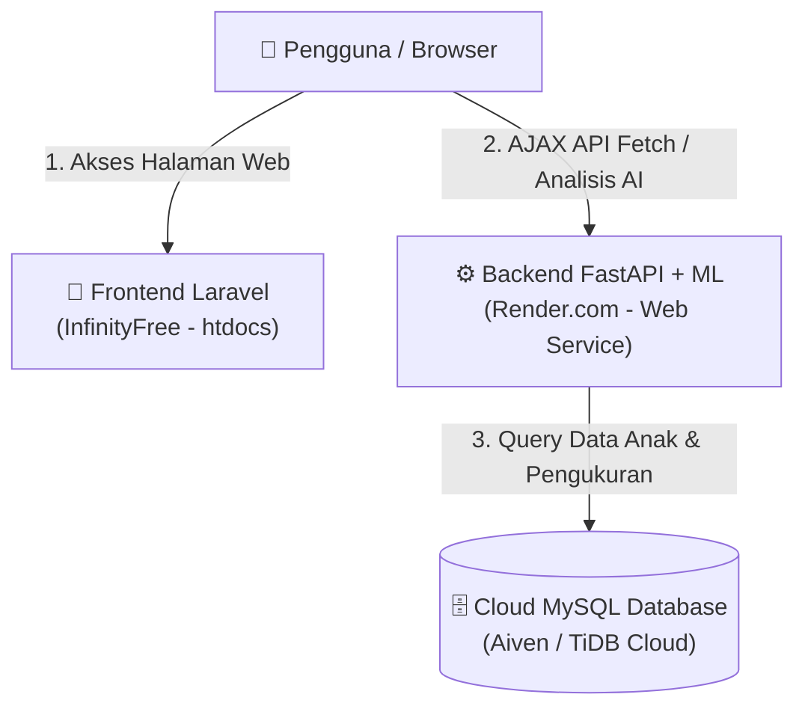

# 🚀 Panduan Deploy Lengkap: Si Anting (InfinityFree + Render.com + Cloud MySQL)

Dokumen ini adalah panduan langkah demi langkah (*step-by-step*) untuk mendeploy aplikasi **Si Anting** secara **100% GRATIS** menggunakan arsitektur terpisah (*Decoupled Architecture*).

---

## ⚠️ 1. Memahami Arsitektur & Keterbatasan InfinityFree

### Mengapa Tidak Bisa Deploy Semuanya di InfinityFree?
* **InfinityFree** adalah layanan *Shared Hosting PHP/MySQL*. Hosting jenis ini **HANYA bisa menjalankan aplikasi PHP (seperti Laravel)**.
* **InfinityFree TIDAK MENDUKUNG Python, FastAPI, Uvicorn, ataupun library Machine Learning (`scikit-learn`, `pandas`)** karena membutuhkan proses server yang aktif terus-menerus di latar belakang (*daemon/ASGI server*).

### Solusi Arsitektur 100% Gratis
Agar sistem deteksi stunting berbasis AI tetap berfungsi penuh secara gratis, kita membagi deployment menjadi 3 bagian:
1. 🗄️ **Database MySQL:** Di-deploy ke **[Aiven.io](https://aiven.io/) / [TiDB Cloud](https://tidbcloud.com/)** (Cloud MySQL Gratis).
2. ⚙️ **Backend (FastAPI + ML Python):** Di-deploy ke **[Render.com](https://render.com/)** (Free Web Service).
3. 🎨 **Frontend (Laravel 12):** Di-deploy ke **[InfinityFree](https://www.infinityfree.com/)** (`htdocs`).

---



---

## 🗄️ 2. Langkah 1: Deploy Database MySQL (Cloud Gratis)

1. Daftar akun gratis di **[Aiven.io](https://aiven.io/)** (pilih paket *Free MySQL*) atau **[TiDB Cloud](https://tidbcloud.com/)** (pilih *Serverless Free Tier*).
2. Buat database baru dengan nama `si_anting_db`.
3. Setelah database aktif, catat **Informasi Koneksi** berikut:
   * **Host / Server:** `mysql-xxx.aivencloud.com` (contoh)
   * **Port:** `3306` atau `25060`
   * **User / Username:** `avnadmin` (contoh)
   * **Password:** *(Kata sandi database)*
   * **Database Name:** `si_anting_db`

### Cara Mengelola & Melihat Isi Tabel Aiven (Pengganti phpMyAdmin)
* **Aiven tidak menyediakan phpMyAdmin** (karena merupakan layanan Cloud DBaaS murni).
* **⚡ Anda TIDAK PERLU membuat tabel secara manual!**
  Begitu Backend FastAPI (`stunting_app`) dijalankan di Render.com dan terhubung ke MySQL Aiven, sistem ORM (`SQLAlchemy` & `Alembic`) akan **otomatis membuat seluruh tabel** (`users`, `guardians`, `children`, `measurements`, `stunting_results`, dll) beserta relasinya.
* **Cara Melihat Isi Tabel Menggunakan Aplikasi HeidiSQL (Gratis & Ringan):**
  1. Download aplikasi [HeidiSQL](https://www.heidisql.com/download.php) untuk Windows (~5 MB).
  2. Buka HeidiSQL, klik **New**, lalu masukkan:
     - **Hostname/IP:** *Host Aiven Anda* (contoh: `sianting-xxx.d.aivencloud.com`)
     - **User:** `avnadmin`
     - **Password:** *Password Aiven Anda*
     - **Port:** *Port Aiven Anda* (contoh: `10148`)
     - **Databases:** `si_anting_db` (atau `defaultdb`)
  3. **Wajib Aktifkan SSL:** Pindah ke tab **"SSL"** di HeidiSQL, lalu pada **SSL mode** pilih **"Require SSL"** (karena Aiven mewajibkan koneksi SSL aman).
  4. Klik **Open** untuk melihat seluruh tabel, query SQL, dan mengelola isi data layaknya phpMyAdmin!

---

## ⚙️ 3. Langkah 2: Deploy Backend FastAPI & Machine Learning ke Render.com

1. **Push folder Backend (`stunting_app`) ke GitHub Anda.**
2. Login ke **[Render.com](https://render.com/)**, klik **New > Web Service**, lalu pilih repositori GitHub backend Anda.
3. Atur konfigurasi dasar Web Service di Render:
   * **Name:** `si-anting-api` (atau sesuai keinginan)
   * **Region:** *Singapore / Frankfurt / US* (pilih yang terdekat)
   * **Environment:** `Python 3`
   * **Build Command:**
     ```bash
     pip install -r requirements.txt
     ```
   * **Start Command:**
     ```bash
     uvicorn stunting_app.main:app --host 0.0.0.0 --port $PORT
     ```
4. Di menu **Environment > Environment Variables**, tambahkan kredensial database dari **Langkah 1**:
   * `DB_HOST` = `<Host MySQL Anda>`
   * `DB_PORT` = `<Port MySQL Anda>`
   * `DB_USER` = `<Username MySQL Anda>`
   * `DB_PASSWORD` = `<Password MySQL Anda>`
   * `DB_NAME` = `<Nama Database Anda>`
   * `JWT_SECRET` = `kunci-rahasia-si-anting-2026-super-aman` *(isi string acak minimal 32 karakter)*
5. Klik **Create Web Service**.
6. Tunggu proses *build & deploy* selesai (~3–5 menit).  
   👉 Anda akan mendapatkan **URL Backend Produksi**, contoh:  
   `https://si-anting-api.onrender.com`
7. Buka browser dan coba kunjungi `https://si-anting-api.onrender.com/docs` untuk memastikan Swagger UI API sudah online.

### 💡 Alternatif Hosting Backend 100% Gratis Tanpa Kartu Kredit (Railway, Hugging Face Spaces & Koyeb)
Jika akun Render.com Anda tetap meminta verifikasi kartu kredit, silakan gunakan alternatif berikut yang **100% GRATIS selamanya tanpa kartu kredit**:

#### A. Opsi 1 (Paling Direkomendasikan): Railway.app (Free Trial $5 Tanpa Kartu Kredit)
1. Buka situs **[railway.app](https://railway.app/)** → Klik **Login with GitHub**.
2. Klik **"+ New Project"** → Pilih **"Deploy from GitHub repo"** → Pilih repositori `sistem-analisis-anak-stunting` (branch `api`).
3. Di tab **Variables**, tambahkan 6 variabel MySQL Aiven (`DB_HOST`, `DB_PORT`, `DB_USER`, `DB_PASSWORD`, `DB_NAME`, `JWT_SECRET`).
4. Di tab **Settings > Networking**, klik **"Generate Domain"** untuk mendapatkan URL produksi resmi (contoh: `https://sistem-analisis-anak-stunting-production.up.railway.app`).

#### B. Opsi 2: Hugging Face Spaces (Sangat Direkomendasikan untuk AI/Python)
1. Daftar akun gratis di **[huggingface.co/join](https://huggingface.co/join)** (hanya menggunakan email).
2. Setelah login, klik foto profil di pojok kanan atas → **New Space**.
3. Isi **Space name:** `si-anting-api`, lalu pada pilihan **Space SDK**, pilih **Docker** (Blank).
4. Klik **Create Space**.
5. Di halaman Space baru Anda, sambungkan dengan repositori GitHub backend ini (atau upload file backend termasuk file `Dockerfile` yang sudah disediakan).
6. Di menu **Settings > Variables and secrets**, tambahkan `DB_HOST`, `DB_PORT`, `DB_USER`, `DB_PASSWORD`, `DB_NAME`, dan `JWT_SECRET` pada bagian **Secrets**.
7. Space akan otomatis berstatus **Running** dan Anda akan mendapatkan URL produksi gratis (misal: `https://username-si-anting-api.hf.space`).

#### B. Opsi 2: Koyeb.com (1 Free Web Service Tanpa Kartu Kredit)
1. Daftar menggunakan akun GitHub Anda di **[koyeb.com](https://www.koyeb.com/)**.
2. Klik **Create Service** → Pilih **GitHub** → Pilih repositori Backend Anda.
3. Koyeb akan otomatis membaca `Dockerfile` yang telah disediakan.
4. Masukkan Environment Variables MySQL Aiven Anda, pilih paket **Free ($0)**, dan klik **Deploy**!

---

## 🎨 4. Langkah 3: Persiapan & Build Frontend Laravel (di Komputer Lokal)

Sebelum mengupload file ke InfinityFree, Anda harus menyetel alamat URL Backend dan membuat bundle *production build* di komputer Anda:

### A. Ubah File `.env` Laravel
Buka file `.env` di folder Laravel (`Si Anting`) dan ubah variabel berikut:

```env
APP_NAME="Si Anting"
APP_ENV=production
APP_KEY=base64:xxx...(biarkan sesuai kunci asli Anda)
APP_DEBUG=false
APP_URL=https://namadomainanda.infinityfreeapp.com

# URL Backend FastAPI dari Render.com
VITE_API_URL=https://si-anting-api.onrender.com
```

### B. Build Asset Frontend via Terminal
Buka terminal di dalam folder Laravel (`Si Anting`), lalu jalankan perintah compile asset:

```bash
npm install
npm run build
```
*Perintah ini akan membuat folder **`public/build`** yang berisi file CSS & JavaScript siap produksi dengan referensi ke URL backend Render Anda.*

---

## 📤 5. Langkah 4: Upload ke InfinityFree (htdocs)

InfinityFree menggunakan struktur folder utama bernama **`htdocs`** (berbeda dengan Laravel yang menggunakan `public`). Ikuti langkah-langkah penataan folder di File Manager InfinityFree (via FileZilla FTP atau Web File Manager):

### A. Struktur Folder di InfinityFree
Agar aman dan rapi, kita taruh **kode inti Laravel di luar `htdocs`** dan **isi folder `public/` di dalam `htdocs`**:

```text
/ (Root Directory Hosting InfinityFree)
├── laravel_app/             <-- 1. Upload semua file/folder Laravel ke sini (KECUALI isi folder public)
│   ├── app/
│   ├── bootstrap/
│   ├── config/
│   ├── resources/
│   ├── vendor/
│   ├── .env                 <-- Pastikan .env produksi ada di sini
│   └── ...
└── htdocs/                  <-- 2. Upload SEMUA ISI DARI folder public/ Laravel ke sini
    ├── build/               <-- Hasil dari npm run build
    ├── favicon.ico
    ├── .htaccess            <-- SANGAT PENTING untuk routing URL Laravel
    └── index.php            <-- File index.php yang sudah diedit path-nya
```

### B. Langkah-Langkah Upload & Edit:
1. Buat folder baru bernama **`laravel_app`** di root hosting Anda (sejajar dengan `htdocs`).
2. Upload **seluruh isi proyek Laravel Anda** ke dalam folder `laravel_app` tersebut.
3. Buka folder `public/` di komputer lokal Anda, lalu copy/upload **semua isi di dalam folder `public/`** ke dalam folder **`htdocs/`** di hosting InfinityFree.
4. **Edit File `htdocs/index.php` di InfinityFree:**
   Buka file `index.php` yang baru saja diupload ke `htdocs/`, lalu sesuaikan 2 baris `require` agar menunjuk ke folder `laravel_app`:

   ```diff
   - require __DIR__.'/../vendor/autoload.php';
   - $app = require_once __DIR__.'/../bootstrap/app.php';
   + require __DIR__.'/../laravel_app/vendor/autoload.php';
   + $app = require_once __DIR__.'/../laravel_app/bootstrap/app.php';
   ```

5. **Pastikan File `.htaccess` Terupload ke `htdocs/`:**
   Pastikan file tersembunyi `.htaccess` dari folder `public/` lokal turut terupload ke dalam `htdocs/.htaccess`. Tanpa file ini, setiap kali pengguna mengakses halaman `/detect`, `/about`, atau `/dashboard`, server akan menghasilkan error **404 Not Found**.

---

## 🛠️ 6. Troubleshooting & Tips Penting

### 1. Pesan Error "404 Not Found" saat Buka URL (selain Beranda)
* **Penyebab:** File `.htaccess` belum terupload ke dalam folder `htdocs/`.
* **Solusi:** Pastikan file `public/.htaccess` bawaan Laravel ada di dalam `htdocs/.htaccess`.

### 2. Pesan Error "CORS Policy Blocked" di Browser Console
* **Penyebab:** Domain frontend InfinityFree belum dikenali di CORS backend atau `VITE_API_URL` salah ketik.
* **Solusi:**
  1. Pastikan `VITE_API_URL` di `.env` lokal Anda menunjuk tepat ke `https://si-anting-api.onrender.com` (tanpa garis miring `/` di akhir).
  2. Pastikan middleware CORS di FastAPI (`main.py`) sudah menggunakan `allow_origins=["*"]` atau mendaftarkan domain InfinityFree Anda.

### 3. Halaman Web Kosong / Blank White Page
* **Penyebab:** Path di `htdocs/index.php` salah menunjuk folder `laravel_app` atau folder `storage` tidak memiliki izin tulis.
* **Solusi:** Periksa kembali penulisan `__DIR__.'/../laravel_app/...'` di `index.php`.

---

## ✅ Checklist Selesai Deploy
- [ ] Database MySQL di **Aiven/TiDB** aktif dan bisa dihubungi.
- [ ] Backend FastAPI di **Render.com** online (`/docs` bisa dibuka).
- [ ] File `.env` Laravel menggunakan `VITE_API_URL` produksi dan sudah di-build (`npm run build`).
- [ ] Isi folder `public/` sudah berada di dalam `htdocs/` InfinityFree.
- [ ] Path `require` di `htdocs/index.php` sudah disesuaikan ke folder `laravel_app`.
- [ ] Cek status gizi anak di web InfinityFree → Prediksi AI berhasil dan data tersimpan ke akun!
