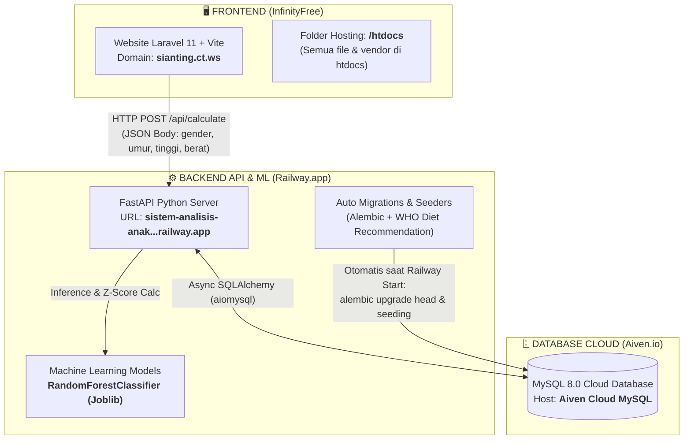

# 🌐 INFORMASI & ARSITEKTUR SISTEM DEPLOYMENT SI ANTING
**Sistem Deteksi, Analisis, dan Rekomendasi Gizi Anak Stunting & Wasting (WHO LMS + Machine Learning)**

Dokumen ini adalah referensi lengkap agar Anda **tidak pernah lupa** di mana dan bagaimana komponen **Frontend**, **Backend API**, dan **Database Cloud** dari aplikasi **Si Anting** di-deploy dan saling terhubung.

---

## 🗺️ DIAGRAM ARSITEKTUR FULL-STACK



---

## 1️⃣ FRONTEND (LARAVEL 11 + BLADE + VITE)

| Item | Keterangan |
| :--- | :--- |
| **Layanan Hosting** | **InfinityFree** (Control Panel / VistaPanel Free Hosting) |
| **Alamat Website (Domain)** | [http://sianting.ct.ws](http://sianting.ct.ws) *(dan https://sianting.ct.ws)* |
| **Framework & Styling** | Laravel 11, PHP 8.2, Blade Templating, Vite Assets |
| **Lokasi File di Hosting** | Seluruh proyek Laravel (termasuk `app`, `config`, `vendor`, `.env`, `.htaccess`, `index.php`) ditaruh di dalam folder **`htdocs/`** |
| **Komunikasi ke Backend** | Menggunakan variabel `VITE_API_URL` dan `API_BASE_URL` di dalam file `.env` |

### 🔑 Pengaturan Khusus di File `htdocs/index.php` (Agar Lolos Aturan `open_basedir`):
Karena di InfinityFree semua file berada di dalam `htdocs`, file `index.php` disesuaikan tanpa titik-titik (`..`) dan menambahkan **`$app->usePublicPath(__DIR__);`**:

```php
<?php

use Illuminate\Http\Request;

define('LARAVEL_START', microtime(true));

// Tampilkan error jika ada masalah di server
ini_set('display_errors', 1);
error_reporting(E_ALL);

// 1. Maintenance check (Tanpa ..)
if (file_exists($maintenance = __DIR__.'/storage/framework/maintenance.php')) {
    require $maintenance;
}

// 2. Composer autoloader (Tanpa ..)
require __DIR__.'/vendor/autoload.php';

// 3. Bootstrap Laravel & usePublicPath (Tanpa ..)
$app = require_once __DIR__.'/bootstrap/app.php';

// Wajib: Beritahu Laravel bahwa folder public kita adalah htdocs ini!
$app->usePublicPath(__DIR__);

$app->handleRequest(Request::capture());
```

### 📋 Contoh Isi File `.env` Produksi (di dalam `htdocs/.env`):
```env
APP_NAME="Si Anting"
APP_ENV=production
APP_KEY=base64:v3q... (APP KEY LARAVEL ANDA)
APP_DEBUG=true
APP_URL=http://sianting.ct.ws

# Koneksi ke Backend API Railway
VITE_API_URL=https://sistem-analisis-anak-stunting-production.up.railway.app
API_BASE_URL=https://sistem-analisis-anak-stunting-production.up.railway.app
```

---

## 2️⃣ BACKEND API & MACHINE LEARNING (FASTAPI PYTHON)

| Item | Keterangan |
| :--- | :--- |
| **Layanan Hosting** | **Railway.app** (Cloud Container Platform) |
| **Alamat API Resmi** | [https://sistem-analisis-anak-stunting-production.up.railway.app](https://sistem-analisis-anak-stunting-production.up.railway.app) |
| **Repositori GitHub** | `https://github.com/dika8912/sistem-analisis-anak-stunting.git` (Branch: **`api`**) |
| **Framework Utama** | FastAPI, Uvicorn, Pydantic, SQLAlchemy Async (`aiomysql`), Alembic |
| **Engine ML** | Scikit-Learn (`RandomForestClassifier` untuk prediksi Stunting & Wasting) |
| **Lokasi Model ML** | `stunting_app/ml/models/stunting_model.joblib` & `wasting_model.joblib` |

### 🚀 Otomatisasi Ketika Server Railway Menyala (`Dockerfile`):
Setiap kali ada perubahan kode yang di-push ke branch `api`, Railway akan merekonstruksi container dan menjalankan perintah:
1. `alembic upgrade head` — Membuat/memperbarui struktur tabel MySQL di Aiven.
2. `python -m stunting_app.seeds.food_recommendation_seed` — Mengisi 36 data panduan rekomendasi makanan WHO & ML.
3. `uvicorn stunting_app.main:app` — Menyalakan server API FastAPI pada port `8000` (atau port dinamis Railway).

### 🛡️ Keamanan CORS (Cross-Origin Resource Sharing):
Backend API dikonfigurasi untuk menerima permintaan (termasuk kredensial) dari:
- `http://sianting.ct.ws` & `https://sianting.ct.ws`
- `https://sianting.bilikku.my.id` & `https://www.sianting.bilikku.my.id`
- `http://localhost:8000` & `http://127.0.0.1:8000`
- Wildcard Regex (`.*`) agar domain frontend tidak pernah terblokir CORS.

---

## 3️⃣ DATABASE CLOUD (MYSQL AIVEN.IO)

| Item | Keterangan |
| :--- | :--- |
| **Layanan Hosting** | **Aiven.io** (Free Cloud Database Service) |
| **Jenis Database** | **MySQL 8.0** |
| **Cara Terhubung** | Menggunakan driver asinkron `mysql+aiomysql://` yang diset pada Environment Variables Railway |

### 🗃️ Daftar Tabel Utama di Database MySQL:
1. **`guardians`** — Menyimpan profil orang tua / wali anak.
2. **`children`** — Menyimpan profil anak (nama, jenis kelamin, tanggal lahir).
3. **`measurements`** — Riwayat pengukuran fisik anak (tinggi, berat, umur bulan, tanggal ukur).
4. **`stunting_results`** — Menyimpan hasil kalkulasi Z-score WHO (`HAZ`, `WAZ`, `WHZ`) dan status klasifikasi Machine Learning beserta skor konfidensi (`ml_stunting_confidence`).
5. **`who_standards`** — Tabel parameter referensi kurva standar pertumbuhan WHO (`L`, `M`, `S` values).
6. **`food_recommendations`** — 36 panduan makanan medis & intervensi gizi berbasis status Z-score dan ML.

---

## 4️⃣ CHEAT SHEET TROUBLESHOOTING (PEMECAHAN MASALAH CEPAT)

### ❓ 1. Mengapa Muncul `500 Internal Server Error` Saat Buka `sianting.ct.ws`?
* **Penyebab:** Aturan Apache `Options` (seperti `Options -MultiViews -Indexes`) di file `.htaccess` dilarang oleh server InfinityFree.
* **Solusi:** Buka File Manager InfinityFree ➔ folder `htdocs` ➔ edit file `.htaccess` ➔ hapus atau beri tanda `#` di depan baris `Options -MultiViews -Indexes`.

### ❓ 2. Mengapa Muncul `open_basedir restriction in effect` di InfinityFree?
* **Penyebab:** Ada skrip PHP yang mencoba keluar dari folder `/htdocs` (menggunakan path `..`).
* **Solusi:** Pastikan **seluruh file proyek** berada di dalam `/htdocs` dan gunakan file `index.php` yang sudah dibersihkan dari tanda dua titik (`..`).

### ❓ 3. Mengapa Muncul `Vite manifest not found`?
* **Penyebab:** Laravel mencari file CSS/JS di `public/build/manifest.json`, sedangkan foldernya ada di `htdocs/build/`.
* **Solusi:** Tambahkan baris `$app->usePublicPath(__DIR__);` pada file `htdocs/index.php` sebelum `$app->handleRequest(...)`.

### ❓ 4. Mengapa Muncul Error CORS / 400 di Browser Saat Klik Hitung Stunting?
* **Penyebab:** Domain Frontend belum terdaftar di pengaturan CORS Backend Railway.
* **Solusi:** Pastikan domain (`http://sianting.ct.ws`) tercantum pada variabel `CORS_ORIGINS` di `stunting_app/config/settings.py` pada repository GitHub (`branch api`), lalu biarkan Railway melakukan redeploy.

---
*Dokumen ini dibuat otomatis sebagai panduan pemeliharaan sistem Si Anting.*
